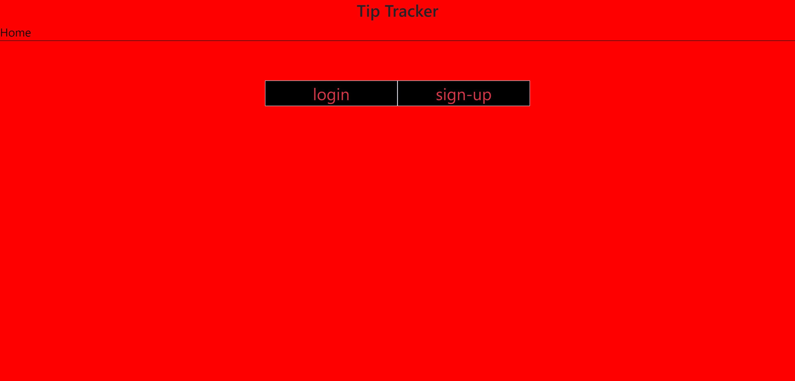

# Tip Tracker

## Description

Tip Tracker provides a user an easy way to keep track of how much they make working a job in which they earn tips on top of an hourly wage. After they’ve made an account, they can add as many jobs to their account as they want and then for each job enter their hourly wage. They can then enter how many hours they worked, how many tips they made, and the date that they worked. This data is recorded and displayed along with a line graph showing fluctuations in total income for that job, providing the user with an easy-to-read visual representation of their income.

## Table of Contents

* [Installation](#installation)

* [Usage](#usage)

* [License](#license)

* [Contributors](#contributors)

* [Tests](#tests)

* [Credits](#credits)

* [Questions](#questions)

## Installation

N/A

## Usage

Follow [this](https://glacial-forest-64795-68107cdee685.herokuapp.com/) link to open the application.

On opening the application, you will see the following page or similar:

From here, the user can login or signup. Once they've entered their account, they can add a job to their account along with the hourly wage associated with that job. Then, for each job, they can enter how many tips they made on a certain day and how many hours they worked. The application will then record and display this information along with a line graph showing income fluctuation.

## License

Please refer to the license in the repo.

## Contributors

## Tests

N/A

## Credits

N/A

## Questions

If you have any questions about the repo, open an issue or contact me directly. You can find more of my work at [Calebjwood](https://github.com/Calebjwood/).